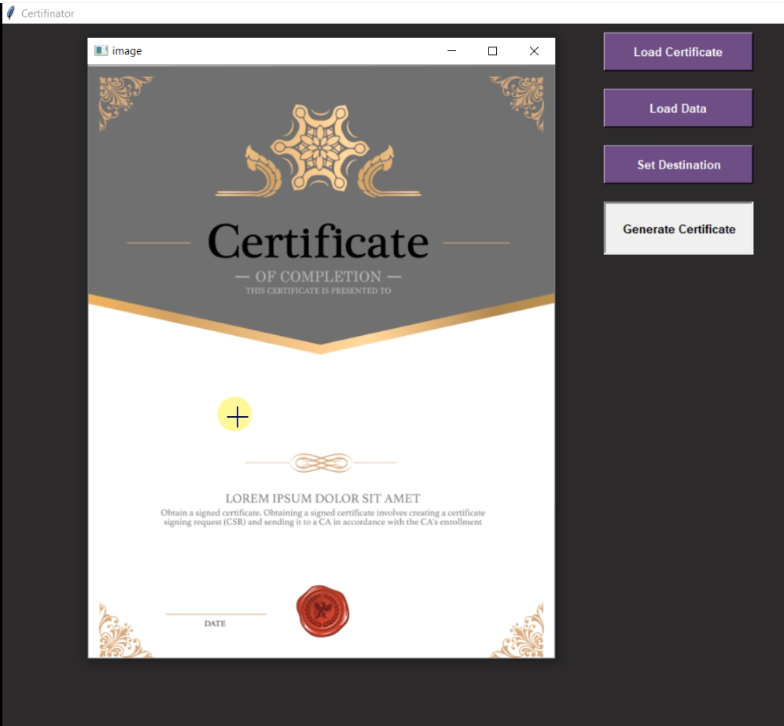
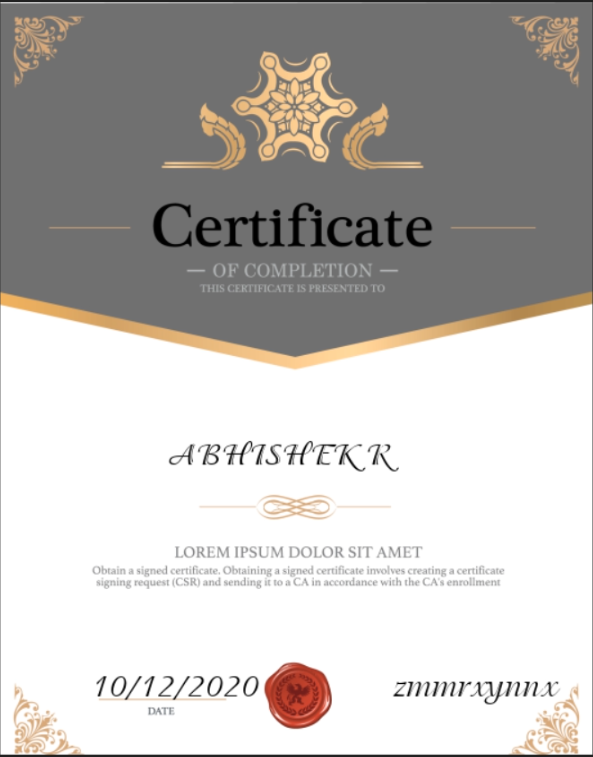
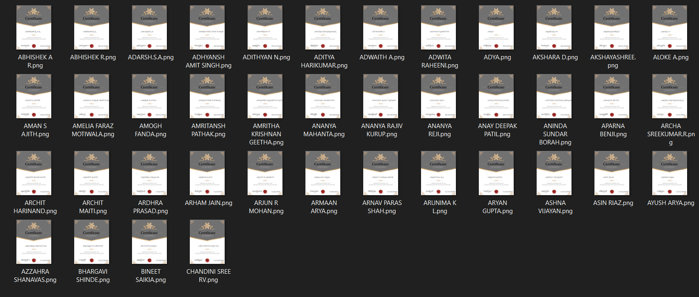

# Certifinator

## Description
The objective of the application is to automatically generate certificates by mapping relevant content from a database(csv, excel) to user configured position on the certificate. 

The application lets the user load any certificate template and a database whose content they want to map to the certificate. The program will store the user-clicked configuration in the form of coordinates and print the content from database to certificate automatically with utmost accuracy. The advantage of such a program is it's flexibility, we are confident that it will support any sample certificate design chosen by the user. Simplicity and user friendliness has been kept in mind while creating the GUI. 

## Instructions 
1. First launch the application "Certifinator.exe".
2. The EXE file and font folder should be in same folder.
3. Click "Load Certificate" and select the certificate template(PNG or JPEG) you wish to map content to. 
3. Next, click "Load Data" and select the database in CSV format containing 3 columns and as many rows as you wish (will generate as many certificates). 
4. The program currently only maps 3 types of fields (Ex: Name, Project, Date).
5. Click "Set Destination" and browse to the folder where you wish to store the generated certificates. 
6. Click "Generate Certificate".
7. A preview of the template will pop up.
8. Double click at the point on certificate where you wish to map the 1st column/field of data (Ex: Name).
9. Then hover to the point you wish the print the 2nd column/field of data (Ex: Project) and double click.
10. Repeat same for 3rd column/field (Ex: Date).
11. Close the preview and open the destination folder, the generated certificates will be available.

## Demo
Setting the coordinates by double clicking 
  
Sample generated certificate 
  
All generated certificates stored in destination folder 

